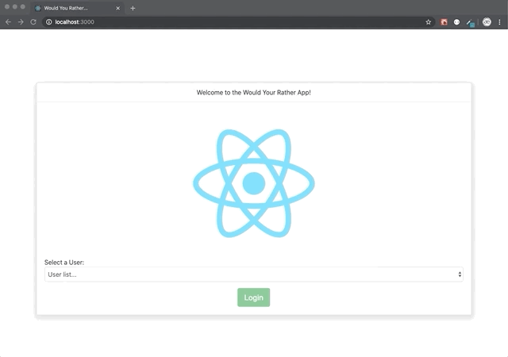
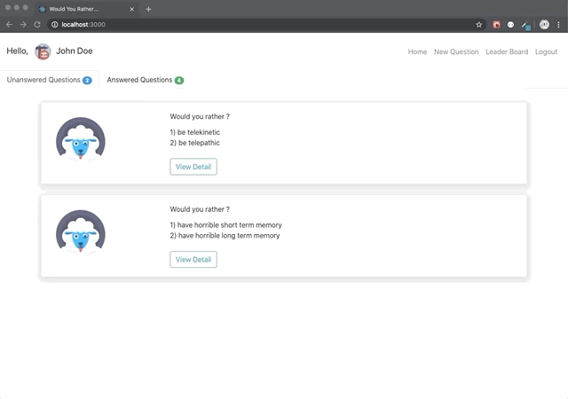
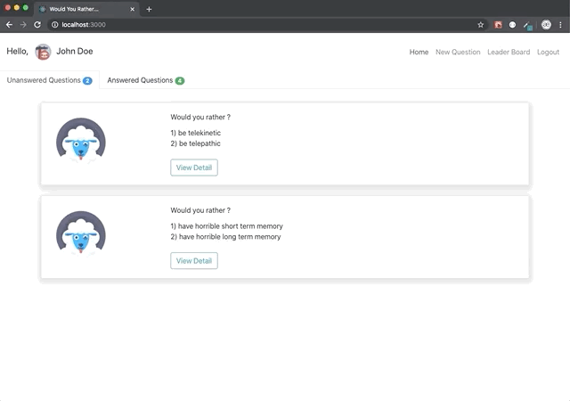
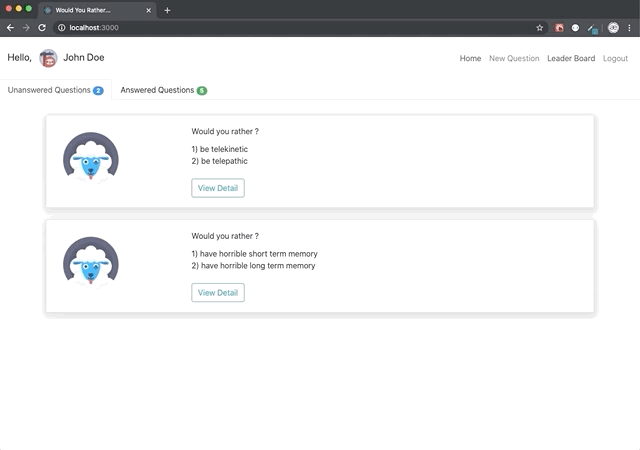

# "Would you rather" app

## Project:

This app was built as a project for the Udacity React Nanodegree Program. The purpose of the project is to demonstrate understanding of how Redux works in a React-based web app.

  
## Installation

  To get started:

* Clone the project: `https://github.com/eoaranda/reactnd-project-would-you-rather.git`
* Install all project dependencies with `npm install`

* Start server with `npm start`

* Navigate to `http://localhost:3000/`
  
  
## Parts of the Application

* [`Login`](#login)
* [`Answered`](#answered)
* [`Un-Answered Questions`](#unanswered)
* [`New Questions`](#new)
* [`Leaderboard`](#leaderboard)

### `Login`
* Login into the application using one of the exiting users from the drop down.

### `Answered Questions`
* Display the Answered questions by the Logged in user.
  

### `Un-Answered Questions`
* Display the remaining questions to be answered by the Logged in user.
  

### `New Questions`
* Create a new `would you rather` question for all the users to answer.

### `Leaderboard`
* See the `user` that has answered more questions and who has the highest score.

## Extras

* As an extra I used the `reactstrap` library, based on Bootstrap 4.  [https://reactstrap.github.io/](https://reactstrap.github.io/)